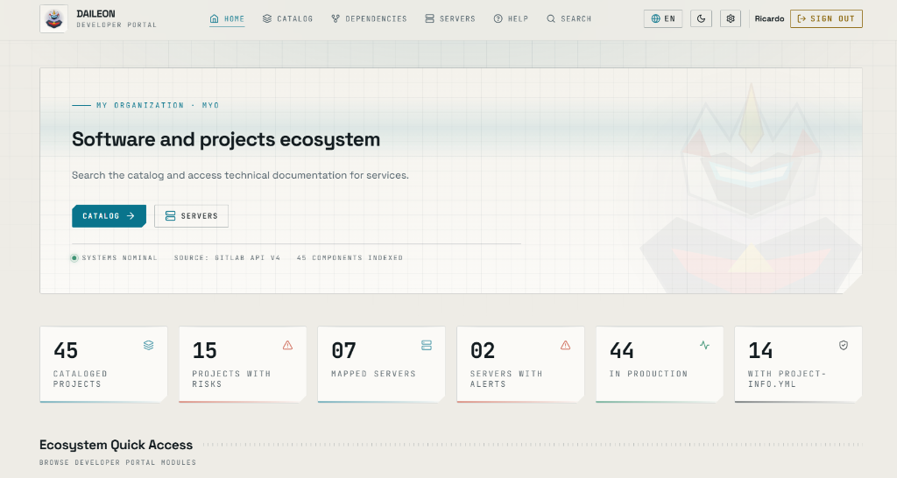

# Daileon

Developer portal for component cataloging.



## Configuration & Environment Variables

#### 1. GitLab Integration
Used for synchronizing repositories and projects in the catalog.

| Variable | Description | Default Value | Required? |
| :--- | :--- | :--- | :--- |
| `GITLAB_URL` | GitLab instance URL. | `https://gitlab.com` | No |
| `GITLAB_READ_TOKEN` | Personal Access Token (PAT) with read scope (`read_api` / `read_repository`). Also accepts `GITLAB_TOKEN`. | `""` | Yes (to sync with GitLab) |
| `GITLAB_GROUP_ID` | ID or path of the group/organization in GitLab whose projects will be imported. | `""` | Recommended |

#### 2. Jenkins Integration
Used for querying CI/CD pipeline status.

| Variable | Description | Default Value | Required? |
| :--- | :--- | :--- | :--- |
| `JENKINS_URL` | Jenkins instance URL. | `https://jenkins.example.com` | No |
| `JENKINS_USER` | Username for Jenkins API authentication. | `""` | Yes (if Jenkins is configured) |
| `JENKINS_API_TOKEN` | Jenkins user API token. | `""` | Yes (if Jenkins is configured) |

#### 3. Database
| Variable | Description | Default Value | Required? |
| :--- | :--- | :--- | :--- |
| `DATABASE_URL` | SQLAlchemy connection string. | `sqlite+aiosqlite:///./data/daileon.db` | No |

#### 4. Local Authentication & Security (Break-Glass)
Local administrator credentials and secret key for signing JWT tokens.

| Variable | Description | Default Value | Required? |
| :--- | :--- | :--- | :--- |
| `ADMIN_USERNAME` | Username for the local admin account. | `admin` | No |
| `ADMIN_PASSWORD` | Password for the local admin account. | `admin123` | **Yes (change in production)** |
| `SECRET_KEY` | Secret key for JWT generation and validation. | `daileon-breakglass-secret-key-change-in-prod` | **Yes (change in production)** |

#### 5. LDAP / Active Directory Authentication
Configuration for corporate LDAP server integration.

| Variable | Description | Default Value | Required? |
| :--- | :--- | :--- | :--- |
| `LDAP_ENABLED` | Enables LDAP authentication (`true` or `false`). | `false` | No |
| `LDAP_SERVER_HOST` | Host or IP of the LDAP server. | `""` | Yes (if `LDAP_ENABLED=true`) |
| `LDAP_SERVER_PORT` | LDAP server connection port. | `389` | No |
| `LDAP_USE_SSL` | Enables SSL connection (`true` or `false`). | `false` | No |
| `LDAP_BIND_DN` | Service account DN used for performing searches in LDAP. | `""` | Yes (if LDAP requires authentication) |
| `LDAP_BIND_PASSWORD` | Service account password for LDAP bind. | `""` | Yes (if LDAP requires authentication) |
| `LDAP_BASE_DN` | Base DN where users will be searched (e.g., `ou=users,dc=company,dc=com`). | `""` | Yes (if `LDAP_ENABLED=true`) |
| `LDAP_USER_ATTRIBUTE` | LDAP attribute corresponding to the user login (e.g., `uid`, `sAMAccountName`). | `uid` | No |

#### 6. Organization
| Variable | Description | Default Value | Required? |
| :--- | :--- | :--- | :--- |
| `ORGANIZATION_NAME` | Organization name displayed in the UI. Also accepts `ORG_NAME`. | `""` | No |
| `ORGANIZATION_ACRONYM` | Organization acronym. Also accepts `ORG_ACRONYM`. | `""` | No |

---

## How to Run

### Via Docker Compose (Recommended)

Start the backend and frontend simultaneously:

```bash
docker compose up -d --build
```

- **Frontend:** `http://localhost:5173`
- **Backend API:** `http://localhost:8000`
- **Swagger Documentation:** `http://localhost:8000/docs`

### Manual Execution for Development

#### Backend
```bash
cd backend
python -m venv .venv
# On Linux/macOS: source .venv/bin/activate
# On Windows: .venv\Scripts\activate
pip install -r requirements.txt
uvicorn main:app --reload --port 8000
```

#### Frontend
```bash
cd frontend
npm install
npm run dev
```