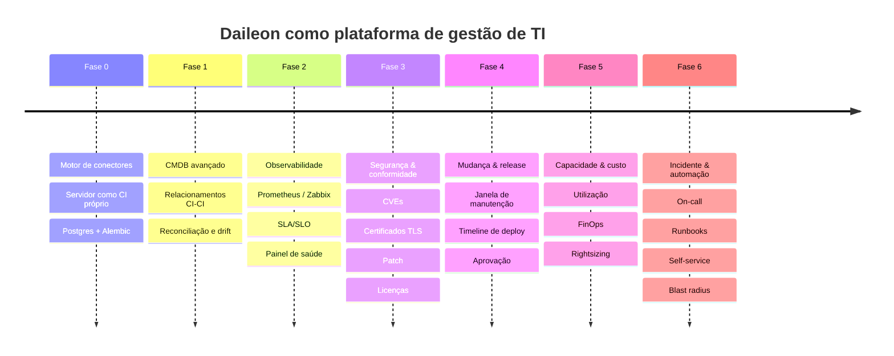

# Roadmap de Evolução — Gestão de TI Avançada

> Complementa o [ROADMAP.md](ROADMAP.md), que trata da evolução funcional
> (Backstage-like: catálogo, TechDocs, scaffolder). Este documento é sobre um eixo
> diferente: transformar o Daileon de **catálogo de software** em **plataforma de
> gestão de infraestrutura** — CMDB, observabilidade, mudança, incidente,
> segurança, capacidade e custo.
>
> Base da análise: código em `main` (commit `e12d3ba`).

---

## 1. A virada de arquitetura que isso exige

Hoje o Daileon é **passivo e de fonte única**: ele lê o GitLab (`app/gitlab/gitlab_crawler.py`),
faz parse de um YAML declarado pelo time (`app/catalog/manifest.py`) e guarda o que
foi declarado. `ComponentDeployment.server_ip`, `.os`, `.port` são strings soltas
digitadas por alguém — nunca verificadas contra a realidade.

Gestão de TI avançada exige o oposto: **múltiplas fontes vivas, reconciliadas
contra o que foi declarado**. Prometheus diz se o servidor está de pé agora, não
o que o YAML disse em março. Um scanner de vulnerabilidade diz o CVE aberto, não
o `execution_type: Docker` escrito à mão.

Isso não é um item do roadmap — é a mudança estrutural que **todo o resto abaixo
depende**: o Daileon precisa de um **motor de conectores plugável** (cada
integração — Prometheus, Zabbix, scanner de CVE, provedor de nuvem — é um
conector que escreve nas mesmas tabelas que hoje só o crawler do GitLab escreve).
A Fase 0 existe para construir esse motor uma vez, bem, em vez de cada
integração nova reinventar autenticação, cache, agendamento e tratamento de erro.

*Nota de escopo: RBAC aplicado é pré-requisito de fato — sem ele, ações
self-service (Fase 6) e aprovação de mudança (Fase 4) não podem existir com
segurança. Não repito a análise aqui; ela está no roadmap de governança
anterior. Trate como bloqueante da Fase 4 em diante.*

---

## 2. Roadmap por pilar

---

### 🔴 Fase 0 — Fundação: motor de conectores + servidor como CI

**0.1 — Modelo `Server` de primeira classe**
Hoje o servidor é um agrupamento *derivado* de `ComponentDeployment` em memória
(`GET /servers` em `app/api/router.py:143` monta isso a cada chamada, agrupando
por nome/IP). Para CMDB de verdade, servidor precisa ser tabela própria:
CPU, RAM, disco, datacenter/rack, hypervisor host (se for VM), criticidade,
responsável técnico. `ComponentDeployment` passa a referenciar `Server` por FK
em vez de repetir `server_ip`/`os` como texto solto em cada linha.

**0.2 — Motor de conectores**
Interface única `Connector` (`fetch()`, `health_check()`, `schedule`) que todo
provedor externo implementa. O GitLab crawler vira o primeiro conector, não um
caso especial. Cada conector novo (Fases 2, 3, 5) só implementa a interface —
autenticação, cache e agendamento já existem.

**0.3 — Postgres + Alembic**
SQLite não sustenta séries temporais de métricas nem escrita concorrente de
múltiplos conectores rodando em paralelo. Migrar antes de abrir a Fase 1.

---

### 🟠 Fase 1 — CMDB avançado

**1.1 — Relacionamentos CI-CI reais**
Hoje só existe `ComponentDependency` (componente → componente, por nome, sem
FK — ver `app/db/models.py:39-46`). CMDB precisa de grafo genérico: componente →
banco de dados, componente → fila, servidor → hypervisor, servidor → storage.
Tabela `CIRelationship(source_ci, target_ci, relationship_type)` cobre os dois casos.

**1.2 — Reconciliação e detecção de drift**
Comparar o que foi *declarado* (`project-info.yml`) com o que foi *descoberto*
(conector de nuvem/hypervisor, ou agente leve). Quando um servidor muda de IP
sem passar pelo YAML, ou um componente aponta para uma porta que não responde,
isso vira um alerta de drift em vez de passar em silêncio — hoje o Daileon
aceita qualquer string sem checar nada.

**1.3 — Histórico de configuração**
Cada mudança em campos de CI (`server_ip`, `port`, `os`) grava uma linha em
`CIHistory`. Pergunta que hoje é impossível responder: "esse IP sempre foi
esse, ou mudou semana passada?"

---

### 🟠 Fase 2 — Observabilidade e saúde

**2.1 — Conector Prometheus/Zabbix**
Hoje a única "saúde" mostrada é o status do Jenkins (`app/jenkins/jenkins_service.py`)
— isso é *pipeline*, não *runtime*. Trazer CPU, memória, disco e uptime por
servidor via Prometheus (`node_exporter`) ou Zabbix API, cacheado como já se
faz com Jenkins (`_jenkins_cache`, TTL de 15s — mesmo padrão, fonte diferente).

**2.2 — Painel de saúde consolidado**
Uma visão por componente que junta build (Jenkins) + deploy (Fase 4) + infra
(Prometheus) + alerta ativo. Hoje essas três coisas vivem em abas separadas.

**2.3 — SLA/SLO**
Campo de meta de disponibilidade por componente crítico (`lifecycle: production`)
e cálculo do realizado a partir da série histórica do conector de observabilidade.
Sem isso, "alta prioridade" é uma etiqueta sem número atrás.

**2.4 — Correlação de alertas**
Alertas disparados no Prometheus Alertmanager ou Zabbix aparecem na página do
componente/servidor afetado, não só na ferramenta de origem.

---

### 🟠 Fase 3 — Segurança e conformidade

**3.1 — Vulnerabilidades (CVE)**
Conector para GitLab Dependency Scanning / Trivy / Dependabot. Lista de CVEs
abertas por componente, com severidade, direto na ficha técnica — hoje
`has_manifest` é o único sinal de risco que existe.

**3.2 — Certificados TLS**
Toda `ComponentDeployment.url` com `https://` é candidata a checagem de
expiração de certificado (handshake TLS agendado pelo conector). Alerta em
D-30/D-7 antes de vencer — causa clássica de incidente evitável.

**3.3 — Conformidade de patch**
Nível de patch do SO por servidor (via conector do provedor de nuvem/hypervisor
ou agente) comparado contra uma baseline definida por criticidade.

**3.4 — Inventário de licenças**
SO, banco de dados e middleware com data de expiração/renovação, vinculados ao
`Server` da Fase 0. Hoje `execution_type` e `os` são texto livre sem nenhum
controle de ciclo de vida.

---

### 🟡 Fase 4 — Mudança e release

*Depende de RBAC aplicado (ver nota de escopo, seção 1) — aprovação de mudança
sem controle de acesso real é teatro.*

**4.1 — Calendário de mudanças / janela de manutenção**
Congelamento vinculado a `Server`/`Component`, bloqueando sync ou deploy
durante o período — hoje não existe conceito de "não mexer nisso agora".

**4.2 — Timeline real de deploy**
O endpoint atual (`/catalog/{id}/jenkins`) só devolve o último build. Persistir
histórico de execuções (via o mesmo conector) responde "quem colocou o quê em
produção, quando" — pré-requisito para qualquer auditoria de mudança.

**4.3 — Aprovação leve (CAB simplificado)**
Deploy em `environment: production` acima de uma criticidade definida exige
segunda aprovação antes de disparar. Fluxo mínimo, não um CAB burocrático.

---

### 🟡 Fase 5 — Capacidade e custo (FinOps)

**5.1 — Série de utilização**
Reaproveita o conector de observabilidade da Fase 2: agrega CPU/mem/disco por
servidor ao longo do tempo, guardado como `MetricSnapshot` (mesmo padrão de
retenção que qualquer série temporal do sistema precisará).

**5.2 — Alocação de custo por time**
Custo de infraestrutura (nuvem via API do provedor, ou amortizado para
on-premise) atribuído por `owner`/domínio. Só faz sentido depois que
propriedade for um modelo real, não texto livre.

**5.3 — Rightsizing**
Servidor com utilização média abaixo de um limiar por N dias vira recomendação
de redimensionamento — dado que a Fase 2 já está coletando.

---

### 🟡 Fase 6 — Incidente e automação

**6.1 — Registro de incidente**
Vinculado a `Server`/`Component`, com linha do tempo e vínculo ao alerta que o
originou (Fase 2.4).

**6.2 — On-call**
Conector para PagerDuty/Opsgenie (ou escala interna simples): quem está de
plantão aparece na página do componente crítico.

**6.3 — Blast radius**
Usa o grafo de relacionamentos da Fase 1.1: "se este servidor cair, o que é
afetado" — hoje o grafo de dependência é só declarativo e nunca é consultado
para simular impacto.

**6.4 — Runbooks e self-service**
Ações operacionais documentadas por componente; ações de baixo risco
(reiniciar, escalar) disparáveis pelo próprio portal, com RBAC e trilha de
auditoria como pré-requisito direto.

---

## 3. Tabela de dependências entre pilares

| Fase | Depende de | Por quê |
| :--- | :--- | :--- |
| 0 | — | Fundação. Nada avança sem isso. |
| 1 CMDB | 0.1, 0.3 | Precisa do `Server` como tabela e de banco que aguente o volume. |
| 2 Observabilidade | 0.2, 1.1 | O conector plugável existe na 0.2; correlacionar alerta a CI usa o grafo da 1.1. |
| 3 Segurança | 0.2 | Só precisa do motor de conectores — pode andar em paralelo com a 1 e 2. |
| 4 Mudança | 2.2, RBAC | Aprovação de produção sem saúde visível e sem controle de acesso é decoração. |
| 5 Capacidade | 2.1 | Reaproveita a coleta de métricas — não existe sem ela. |
| 6 Incidente | 1.1, 2.4, RBAC | Blast radius usa o grafo; correlação usa alertas; self-service exige RBAC. |

**Leitura prática:** 0 é obrigatória primeiro. Depois, 1, 2 e 3 podem correr em
paralelo — não competem por modelo de dados. 4, 5 e 6 são consumidoras: só
valem a pena depois que 1–3 estiverem entregando dado real.

---

## 4. O que isso muda na proposta de valor

| Hoje | Depois deste roadmap |
| :--- | :--- |
| "Aqui está o que o time declarou sobre este servidor" | "Aqui está o que o servidor realmente é, e onde diverge do declarado" |
| Status de build (Jenkins) | Status de build + saúde de runtime + SLA + alerta ativo |
| `has_manifest: true/false` como único sinal de risco | CVEs abertas, certificado a vencer, patch em atraso, licença expirando |
| Deploy é um clique sem histórico | Deploy tem janela, aprovação, timeline auditável |
| Custo de infra não existe no portal | Custo por time, tendência de utilização, recomendação de rightsizing |
| Dependência é uma lista declarada no YAML | Dependência é um grafo consultável para simular impacto de queda |

Esse é o salto de "catálogo de software" (o que o Backstage já faz bem) para
"plataforma de gestão de TI" (o que nenhum concorrente open-source faz de forma
integrada) — e o Daileon já tem a peça mais difícil, o inventário de servidor
com dado de infraestrutura real, que a maioria dos clones de Backstage nem tenta.
