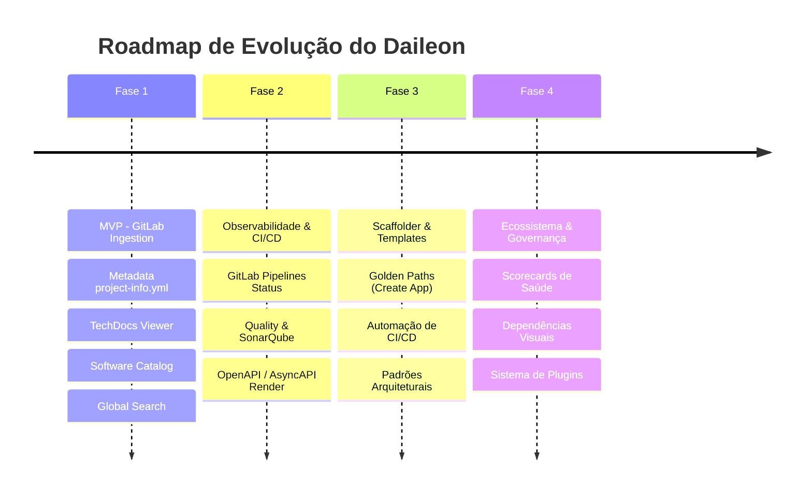

# 🚀 Roadmap do Projeto Daileon

> **Developer Portal Interno Inspirado no Spotify Backstage**  
> *Centralizando o ecossistema de engenharia, catálogo de serviços e documentação viva a partir do GitLab.*

---

## 📌 1. Visão Geral e Propósito

O **Daileon** é uma plataforma de Developer Portal (Developer Experience - DevEx) inspirada no [Spotify Backstage](https://backstage.io/). O objetivo principal do Daileon é reduzir a carga cognitiva dos desenvolvedores e organizar o ecossistema de software da empresa em um único local.

### 💡 Escopo Inicial
- **Varredura Automática do GitLab**: Integração com a API REST/GraphQL do GitLab para crawler automatizado de repositórios.
- **Metadata via `project-info.yml`**: Descoberta e parsing do arquivo de manifesto `project-info.yml` na raiz dos projetos.
- **TechDocs em Markdown**: Leitura automática de documentações `.md` localizadas na pasta `/docs` (ou diretório customizado especificado no `project-info.yml`).
- **Portal Unificado**: Visualização em catálogo centralizado com navegação rica e busca integrada.

---

## 📄 2. Especificação do Arquivo `project-info.yml`

Assim como o `catalog-info.yaml` do Backstage, o **`project-info.yml`** é o contrato de metadados mantido junto ao código fonte de cada projeto.

### Exemplo de Estrutura:
```yaml
apiVersion: daileon/v1
kind: Component # Component, API, Library, Infrastructure, System
metadata:
  name: pagamento-service
  description: "Serviço responsável pelo processamento de pagamentos e liquidação de PIX e Cartões."
  tags:
    - java
    - spring-boot
    - pix
    - finance
  owner: team-payments # Nome do time ou tribo responsável
  domain: checkout

spec:
  type: service # service, website, library, cronjob
  lifecycle: production # experimental, development, production, deprecated
  system: e-commerce-core
  
  docs:
    dir: /docs # Caminho customizado da pasta de documentação (default: /docs)
    index: index.md # Arquivo inicial da documentação (default: index.md)
  
  links:
    - url: https://grafana.empresa.com/d/pagamentos
      title: Grafana Dashboard
      icon: dashboard
    - url: https://api-docs.empresa.com/pagamento-service
      title: OpenAPI Spec
      icon: api

  dependencies:
    - component: usuario-service
    - component: notificacao-service
```

---

## 🎯 3. Sugestão de Funcionalidades para o MVP (Fase 1)

Para o **MVP (Minimum Viable Product)**, focamos nas funcionalidades essenciais que trazem valor imediato à equipe de engenharia:

### 3.1. 🔍 Ingestion Engine & GitLab Crawler (Core Ingestion)
- **GitLab Scanner Service**:
  - Conexão via Personal Access Token / Group Access Token.
  - Crawler agendado e/ou acionado via Webhook GitLab (ex: no push para branch principal).
  - Inspeção e parsing seguro do arquivo `project-info.yml` na raiz de repositórios acessíveis.
- **Fallbacks Inteligentes**:
  - Caso o projeto não possua `project-info.yml`, o Daileon cria um registro sintético básico utilizando as informações nativas da API do GitLab (Nome do Repositório, Descrição, Linguagem Principal e README.md).

### 3.2. 📚 TechDocs Engine (Documentação como Código)
- **Leitor de Documentação Markdown**:
  - Leitura recursiva da pasta `/docs` (ou caminho customizado configurado no `project-info.yml`).
  - Suporte a Markdown completo: Tabelas, Mermaid.js (diagramas de sequência/arquitetura), alertas, blocos de código com sintaxe destacada.
- **Navegação de Docs**:
  - Árvore de arquivos lateral gerada automaticamente com base na estrutura de pastas/arquivos `.md`.
  - Links internos corrigidos automaticamente para navegação fluida dentro do portal.

### 3.3. 🗂️ Software Catalog (Catálogo de Componentes)
- **Tabela / Grid de Componentes**:
  - Visão geral de todos os serviços com filtros rápidos (Linguagem, Time/Owner, Lifecycle, Tipo de componente).
  - Status visual (Em produção, Depreciado, Em desenvolvimento).
- **Página de Detalhes do Serviço**:
  - Resumo do componente, descrição, donos (owners), tags e links externos úteis.
  - Aba de **Documentação (TechDocs)** renderizada.
  - Link direto para o repositório no GitLab.

### 3.4. 🔎 Busca Centralizada (Global Search MVP)
- **Barra de Pesquisa Global**:
  - Indexação do catálogo (nomes, tags, descrições, repositórios).
  - Pesquisa no conteúdo textual das documentações `.md` cadastradas.

### 3.5. 🎨 Interface de Usuário Modern & Premium (Dev Portal UI)
- Portal responsivo com suporte a **Dark / Light Mode**.
- Design limpo, intuitivo e com foco em usabilidade (inspirado na estética moderna do Backstage).

---

## 🗺️ 4. Roadmap de Evolução por Fases



### 🗓️ Detalhamento das Fases

#### 🟢 Fase 1: MVP — Fundação & Catálogo Vivo *(Escopo Atual)*
- [x] Definição da arquitetura e especificação do `project-info.yml`.
- [ ] Construção da API backend de integração com o GitLab API.
- [ ] Engine de Ingestão e Parser de YAML/Markdown.
- [ ] Frontend do Software Catalog com suporte a TechDocs e Busca.

#### 🟡 Fase 2: Observabilidade, CI/CD & APIs
- **Integração de Pipelines GitLab CI/CD**: Exibição do status dos últimos deploys e builds na página do serviço.
- **Visualizador de APIs (OpenAPI / AsyncAPI)**: Renderização Swagger/Redoc para serviços que exportam especificações de API.
- **Qualidade & Métricas**: Exibição de estatísticas do SonarQube (cobertura de testes, code smells, vulnerabilidades).

#### 🟠 Fase 3: Software Templates & Scaffolder ("Golden Paths")
- **Gerador de Projetos (Self-Service)**:
  - Criação de novos serviços a partir de moldes padrão da empresa (Java Spring, Node.js Nest, Python FastAPI, Go, etc.).
  - Criação automática do repositório no GitLab já provisionado com `project-info.yml`, `/docs` e pipeline CI/CD base.

#### 🟣 Fase 4: Governança, Grafo de Dependências & Plugins
- **Grafo de Dependências (Service Map)**: Mapeamento visual das dependências entre serviços e APIs.
- **Scorecards de Engenharia (Tech Health)**: Avaliação da saúde dos projetos (ex: possui docs? usa versão recente do runtime? tem testes?).
- **Arquitetura de Plugins Extensível**: Permite que times criem suas próprias abas e extensões no portal.

---

## 📊 5. Matriz Comparativa: MVP vs. Visão Futura

| Funcionalidade | MVP (Fase 1) | Futuro (Fases 2 a 4) |
| :--- | :--- | :--- |
| **Origem dos Dados** | API do GitLab (`project-info.yml` + `/docs`) | GitLab, Kubernetes, SonarQube, Grafana, AWS/Cloud |
| **Documentação** | Renderizador Markdown (TechDocs) | Markdown + Swagger/OpenAPI + Diagramas dinâmicos |
| **Catálogo** | Lista/Grid com filtros básicos e busca | Grafo interativo de dependências e domínios |
| **Integração CI/CD** | Link direto para o GitLab | Dashboard ao vivo de pipelines e deploys |
| **Criação de Serviços** | Manual no GitLab + adicionar `project-info.yml` | Scaffolder automatizado via Wizard no Portal |
| **Governança** | Verificação de presença do `project-info.yml` | Scorecards de maturidade técnica e compliance |

---

## 🛠️ 6. Próximos Passos Sugeridos para Iniciar o Desenvolvimento

1. **Validação do Modelo `project-info.yml`**: Validar com os times a estrutura do arquivo de metadados.
2. **Definição da Stack Tecnológica do Daileon**:
   - **Backend**: Node.js (TypeScript) / Go / Python (FastAPI).
   - **Frontend**: React (Vite / Next.js) + Tailwind / CSS moderno.
   - **Database / Cache**: PostgreSQL (armazenamento do catálogo indexado) + Redis.
3. **Criação do Protótipo da API de Ingestão**: Testar as chamadas da API do GitLab (`/api/v4/projects`, `/repository/files/project-info.yml`, `/repository/tree`).
