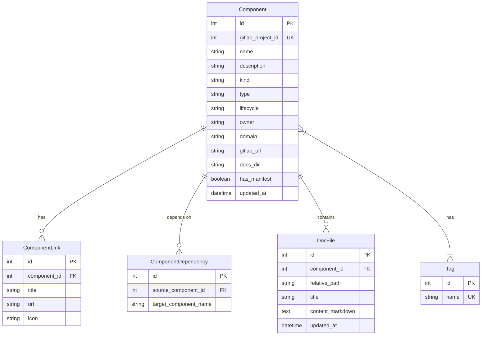

# 🏛️ Daileon Technical Architecture

This document details the internal architecture, data flow, database models and APIs of **Daileon**.

---

## 📐 1. Architecture Diagram

Daileon is a **single process**: FastAPI serves the REST API and delivers the
already-built SPA, from the same origin and the same port.


### Why a single origin

The interface does not use server-side rendering: every piece of data comes
from a client-side `fetch`, authenticated with the token kept in the browser.
Since there was nothing to render before login, the Node runtime acted purely
as a proxy to FastAPI — a network hop that added nothing.

SvelteKit now builds with `adapter-static` (SPA with an `index.html` fallback)
and FastAPI serves the result. Direct consequences:

- one container and one port, instead of two of each;
- no CORS: there is no cross-origin request to allow;
- no `API_URL` in production — `/api` resolves on the origin itself;
- deep-link routing (`/catalog/12/docs/guide.md`) belongs to the client, with
  the server returning `index.html` for any path not claimed by the API
  (see `mount_frontend` in `backend/main.py`).

None of this changes the development workflow: Vite runs on `:5173` with
hot-reload and forwards `/api` to the backend on `:8000`.

---

## 🔧 2. Solution Components

### 2.1. Python Backend (`backend/`)
- **FastAPI**: Asynchronous web framework that exposes the REST API.
- **GitLab Crawler Service (`app/gitlab/gitlab_crawler.py`)**:
  - Consumes `/api/v4/projects` using `GITLAB_READ_TOKEN`.
  - Downloads the raw `project-info.yml` file.
  - Downloads the `/docs` folder tree (`/api/v4/projects/:id/repository/tree`).
  - Updates the database through asynchronous inserts/updates.
- **Pydantic Schema (`app/catalog/manifest.py`)**: Strictly validates the YAML structure of the manifest.
- **SQLAlchemy ORMs (`app/db/models.py`)**:
  - `Component`: Main record of the service/entity.
  - `Tag`: Tags for search and categorization.
  - `ComponentLink`: Observability, metrics and API links.
  - `ComponentDependency`: Dependency graph between services.
  - `DocFile`: Content of the indexed Markdown documentation.

### 2.2. SvelteKit Frontend (`frontend/`)
- **SvelteKit + TailwindCSS**: Fluid interface with dark theme support and responsive components.
- **Static build (`adapter-static`)**: Compiles to plain HTML/CSS/JS under `frontend/build/`, served by FastAPI. `src/routes/+layout.ts` turns SSR and prerender off — that is what allows a single `index.html` fallback to be generated.
- **TechDocs Reader (`src/lib/components/TechDocsViewer.svelte`)**:
  - Converts Markdown to HTML via `marked`.
  - Processes `` ```mermaid `` blocks and dynamically renders sequence, class and flow diagrams with `mermaid.js`.
- **API Client (`src/lib/api.ts`)**: Communicates with the FastAPI backend via `fetch`.

---

## 🗄️ 3. Entity-Relationship Diagram (ERD)



---

## 🌐 4. REST Endpoint Specification

| Method | Route | Description |
| :--- | :--- | :--- |
| `GET` | `/api/catalog` | Lists every catalogued component (supports the `owner`, `type`, `lifecycle` and `tag` filters) |
| `GET` | `/api/catalog/{id}` | Returns the full details of a component |
| `GET` | `/api/catalog/{id}/docs` | Returns the list of Markdown documents of a component |
| `GET` | `/api/catalog/{id}/docs/{path}` | Returns the content of a specific document |
| `POST` | `/api/sync` | Triggers a catalog operation (`update`, `rebuild` or `prune`) and responds `202` right away |
| `GET` | `/api/sync/status?since={cursor}` | Progress of the running operation and the log lines not delivered yet |
| `GET` | `/api/search?q={query}` | Performs the unified search across services and inside the documentation text |
| `GET` | `/api/health` | Service state, registered plugins and whether the compiled interface was found |
