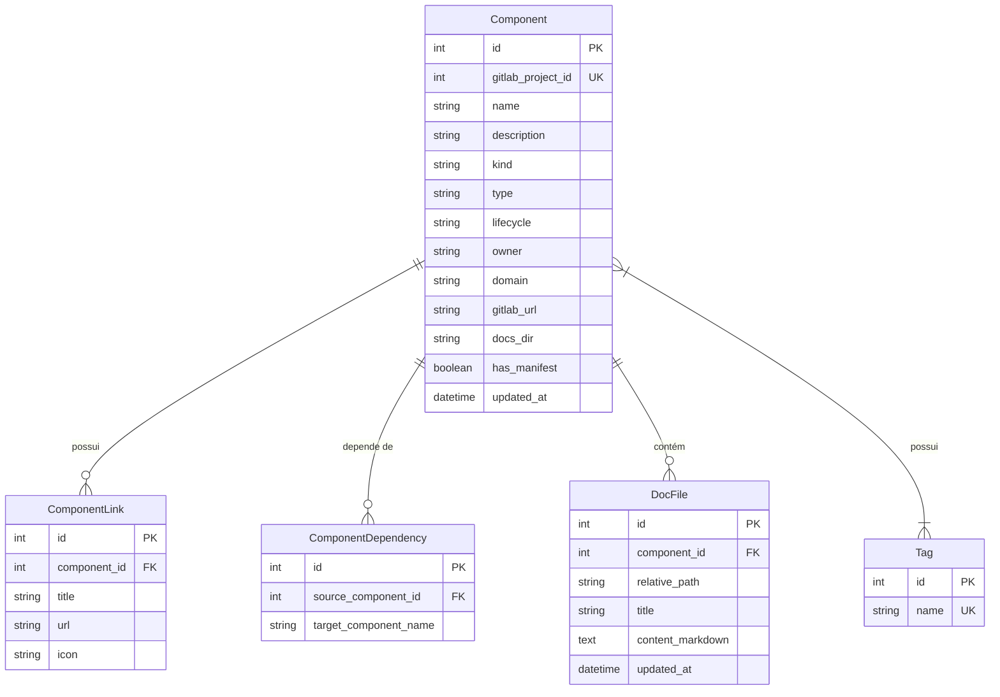

# 🏛️ Arquitetura Técnica do Daileon

Este documento detalha a arquitetura interna, fluxo de dados, modelos de banco de dados e APIs do **Daileon**.

---

## 📐 1. Diagrama de Arquitetura


---

## 🔧 2. Componentes da Solução

### 2.1. Backend Python (`backend/`)
- **FastAPI**: Framework web assíncrono para disponibilização da API REST.
- **GitLab Crawler Service (`app/gitlab/gitlab_crawler.py`)**:
  - Consome `/api/v4/projects` usando `GITLAB_READ_TOKEN`.
  - Baixa o arquivo `daileon.yml` bruto.
  - Baixa a árvore da pasta `/docs` (`/api/v4/projects/:id/repository/tree`).
  - Atualiza o banco de dados via inserções/atualizações assíncronas.
- **Schema Pydantic (`app/catalog/manifest.py`)**: Valida rigorosamente a estrutura YAML do manifesto.
- **ORMs SQLAlchemy (`app/db/models.py`)**:
  - `Component`: Registro principal do serviço/entidade.
  - `Tag`: Tags de busca e categorização.
  - `ComponentLink`: Links de observabilidade, métricas e APIs.
  - `ComponentDependency`: Grafo de dependências entre serviços.
  - `DocFile`: Conteúdo das documentações em Markdown indexadas.

### 2.2. Frontend SvelteKit (`frontend/`)
- **SvelteKit + TailwindCSS**: Interface fluida com suporte a temas escuros e componentes responsivos.
- **Leitor TechDocs (`src/lib/components/TechDocsViewer.svelte`)**:
  - Converte Markdown para HTML via `marked`.
  - Processa blocos `` ```mermaid `` e renderiza diagramas de sequência, classe e fluxo dinamicamente com `mermaid.js`.
- **API Client (`src/lib/api.ts`)**: Comunicação via `fetch` com o backend FastAPI.

---

## 🗄️ 3. Diagrama Entidade-Relacionamento (ERD)



---

## 🌐 4. Especificação dos Endpoints REST

| Método | Rota | Descrição |
| :--- | :--- | :--- |
| `GET` | `/api/catalog` | Lista todos os componentes catalogados (suporta filtros `owner`, `type`, `lifecycle`, `tag`) |
| `GET` | `/api/catalog/{id}` | Retorna os detalhes completos de um componente |
| `GET` | `/api/catalog/{id}/docs` | Retorna a lista de documentos Markdown de um componente |
| `GET` | `/api/catalog/{id}/docs/{path}` | Retorna o conteúdo de um documento específico |
| `POST` | `/api/sync` | Aciona manualmente a sincronização com o GitLab |
| `GET` | `/api/search?q={query}` | Realiza a busca unificada por serviços e dentro do texto das documentações |
