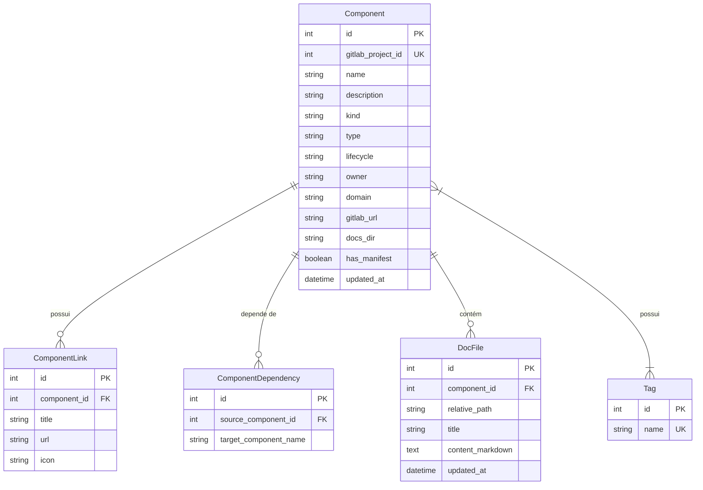

# 🏛️ Arquitetura Técnica do Daileon

Este documento detalha a arquitetura interna, fluxo de dados, modelos de banco de dados e APIs do **Daileon**.

---

## 📐 1. Diagrama de Arquitetura

O Daileon é um **único processo**: o FastAPI atende a API REST e entrega a SPA
já compilada, na mesma origem e na mesma porta.


### Por que uma origem só

A interface não usa renderização no servidor: todo dado vem de `fetch` no
cliente, autenticado com o token guardado no navegador. Como não havia nada
para renderizar antes do login, o runtime Node servia apenas de proxy para o
FastAPI — um salto de rede que não agregava nada.

O SvelteKit passou a compilar com `adapter-static` (SPA com fallback em
`index.html`) e o FastAPI serve o resultado. Consequências diretas:

- um contêiner e uma porta, em vez de dois de cada;
- sem CORS: não há requisição cross-origin a liberar;
- sem `API_URL` em produção — `/api` resolve na própria origem;
- o roteamento de deep links (`/catalog/12/docs/guia.md`) é do cliente, com o
  servidor devolvendo `index.html` para qualquer caminho não reclamado
  pela API (ver `mount_frontend` em `backend/main.py`).

Em desenvolvimento nada disso muda o fluxo de trabalho: o Vite sobe em `:5173`
com hot-reload e encaminha `/api` para o backend em `:8000`.

---

## 🔧 2. Componentes da Solução

### 2.1. Backend Python (`backend/`)
- **FastAPI**: Framework web assíncrono para disponibilização da API REST.
- **GitLab Crawler Service (`app/gitlab/gitlab_crawler.py`)**:
  - Consome `/api/v4/projects` usando `GITLAB_READ_TOKEN`.
  - Baixa o arquivo `project-info.yml` bruto.
  - Baixa a árvore da pasta `/docs` (`/api/v4/projects/:id/repository/tree`).
  - Atualiza o banco de dados via inserções/atualizações assíncronas.
- **Schema Pydantic (`app/catalog/manifest.py`)**: Valida rigorosamente a estrutura YAML do manifesto.
- **ORMs SQLAlchemy (`app/db/models.py`)**:
  - `Component`: Registro principal do serviço/entidade.
  - `Tag`: Tags de busca e categorização.
  - `ComponentLink`: Links de observabilidade, métricas e APIs.
  - `ComponentDependency`: Grafo de dependências entre serviços.
  - `DocFile`: Conteúdo das documentações em Markdown indexadas.

### 2.2. Frontend SvelteKit (`frontend/`)
- **SvelteKit + TailwindCSS**: Interface fluida com suporte a temas escuros e componentes responsivos.
- **Build estático (`adapter-static`)**: Compila para HTML/CSS/JS puros em `frontend/build/`, servidos pelo FastAPI. `src/routes/+layout.ts` desliga SSR e prerender — é o que permite gerar um `index.html` único de fallback.
- **Leitor TechDocs (`src/lib/components/TechDocsViewer.svelte`)**:
  - Converte Markdown para HTML via `marked`.
  - Processa blocos `` ```mermaid `` e renderiza diagramas de sequência, classe e fluxo dinamicamente com `mermaid.js`.
- **API Client (`src/lib/api.ts`)**: Comunicação via `fetch` com o backend FastAPI.

---

## 🗄️ 3. Diagrama Entidade-Relacionamento (ERD)



---

## 🌐 4. Especificação dos Endpoints REST

| Método | Rota | Descrição |
| :--- | :--- | :--- |
| `GET` | `/api/catalog` | Lista todos os componentes catalogados (suporta filtros `owner`, `type`, `lifecycle`, `tag`) |
| `GET` | `/api/catalog/{id}` | Retorna os detalhes completos de um componente |
| `GET` | `/api/catalog/{id}/docs` | Retorna a lista de documentos Markdown de um componente |
| `GET` | `/api/catalog/{id}/docs/{path}` | Retorna o conteúdo de um documento específico |
| `POST` | `/api/sync` | Dispara uma operação de catálogo (`update`, `rebuild` ou `prune`) e responde `202` na hora |
| `GET` | `/api/sync/status?since={cursor}` | Progresso da operação em andamento e as linhas de log ainda não entregues |
| `GET` | `/api/search?q={query}` | Realiza a busca unificada por serviços e dentro do texto das documentações |
| `GET` | `/api/health` | Estado do serviço, plugins registrados e se a interface compilada foi encontrada |
