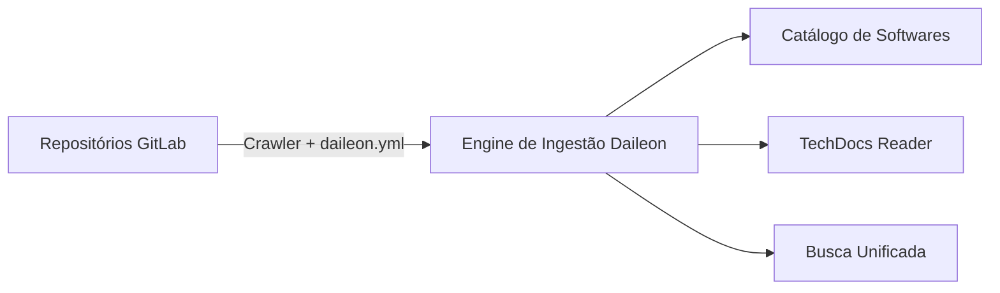

# 🚀 Daileon — Developer Portal Interno

> **Centralizando o Ecossistema de Software, Catálogo de Componentes e Documentação Viva (TechDocs) a partir do GitLab.**

---

## 📌 1. Visão Geral

O **Daileon** é uma plataforma de Developer Portal (Developer Experience - DevEx) inspirada no [Spotify Backstage](https://backstage.io/). 

Seu objetivo principal é reduzir a carga cognitiva dos desenvolvedores, oferecendo uma visão unificada e centralizada de todos os microsserviços, bibliotecas, lambdas, APIs e documentações da empresa sem a necessidade de cadastros manuais repetitivos.



---

## 💡 2. Como Funciona

### 2.1. Ingestão Automática ("Documentation & Metadata as Code")
Cada projeto mantém na raiz do seu repositório um arquivo de manifesto chamado **`daileon.yml`** e uma pasta de documentação (por padrão `/docs`).

O Daileon se conecta à **API REST v4 do GitLab** utilizando o token `GITLAB_READ_TOKEN`:
1. **Varredura**: Lista todos os projetos acessíveis pelo token (ou filtrados por um grupo específico).
2. **Parsing do Manifesto**: Baixa e valida o arquivo `daileon.yml`. Se o arquivo não existir, o Daileon gera automaticamente um registro *sintético* com as informações básicas do repositório GitLab.
3. **Leitura de Docs**: Identifica os arquivos Markdown na pasta `/docs` (ou diretório customizado) e indexa o conteúdo.
4. **Atualização**: Mantém o catálogo de serviços e o motor de busca atualizados no banco de dados.

### 2.2. O Manifesto `daileon.yml`
Exemplo de configuração que cada repositório pode adicionar:

```yaml
apiVersion: daileon/v1
kind: Component
metadata:
  name: pagamento-service
  description: "Serviço responsável pelo processamento de pagamentos e liquidação PIX."
  tags: [java, spring-boot, pix, finance]
  owner: team-payments
  domain: checkout

spec:
  type: service # service, website, library, cronjob
  lifecycle: production # production, experimental, deprecated
  system: e-commerce-core
  
  docs:
    dir: /docs
    index: index.md
  
  links:
    - url: https://grafana.empresa.com/d/pagamentos
      title: Grafana Dashboard
      icon: dashboard
    - url: https://api-docs.empresa.com/pagamento-service
      title: OpenAPI Spec
      icon: api

  dependencies:
    - component: usuario-service
    - component: notificacao-service
```

---

## 🔥 3. Principais Funcionalidades

- **🗂️ Software Catalog**: Tabela e grid visual de componentes com filtros por Time (Owner), Tipo, Lifecycle e Tags.
- **📚 TechDocs Engine**: Renderizador interativo de Markdown com suporte a navegação por árvore de pastas e diagramas **Mermaid.js**.
- **🔎 Busca Centralizada**: Pesquisa rápida em nomes de serviços, tags, responsáveis e conteúdo textual de documentações.
- **⚙️ Sincronização em 1-Clique**: Botão de Sync manual e crawler agendado no portal.
