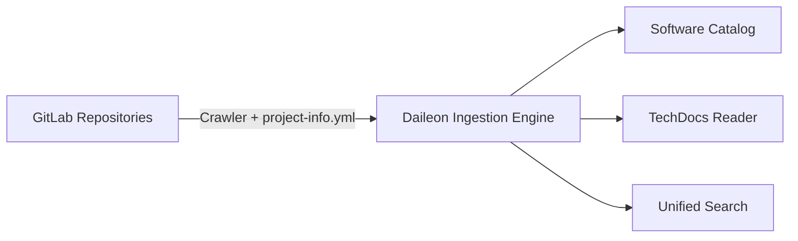

# 🚀 Daileon — Internal Developer Portal

> **Centralizing the software ecosystem, the component catalog and living documentation (TechDocs) straight from GitLab.**

---

## 📌 1. Overview

**Daileon** is a Developer Portal (Developer Experience — DevEx) platform inspired by [Spotify Backstage](https://backstage.io/).

Its main goal is to reduce developers' cognitive load by offering a unified, centralized view of every microservice, library, lambda, API and piece of documentation in the company — with no repetitive manual registration.



---

## 💡 2. How It Works

### 2.1. Automatic Ingestion ("Documentation & Metadata as Code")
Each project keeps a manifest file named **`project-info.yml`** at the root of its repository, plus a documentation folder (`/docs` by default).

Daileon connects to the **GitLab REST API v4** using the `GITLAB_READ_TOKEN` token:
1. **Scan**: Lists every project the token can reach (or only those under a specific group).
2. **Manifest parsing**: Downloads and validates the `project-info.yml` file. If the file does not exist, Daileon automatically generates a *synthetic* record with the basic information from the GitLab repository.
3. **Docs reading**: Identifies the Markdown files inside the `/docs` folder (or a custom directory) and indexes their content. Folders containing a `.daileon-ignore` file are left out — see the [`project-info.yml` Reference](project-info-yml.md).
4. **Update**: Keeps the service catalog and the search engine up to date in the database.

### 2.2. The `project-info.yml` Manifest
Example of the configuration each repository can add:

```yaml
apiVersion: daileon/v1
kind: Component
metadata:
  name: payment-service
  description: "Service responsible for payment processing and PIX settlement."
  tags: [java, spring-boot, pix, finance]
  owner: team-payments
  domain: checkout

spec:
  type: service # service, website, library, cronjob
  lifecycle: production # production, experimental, deprecated
  solution: Strix
  
  docs:
    dir: /docs
    index: index.md
  
  links:
    - url: https://grafana.company.com/d/payments
      title: Grafana Dashboard
      icon: dashboard
    - url: https://api-docs.company.com/payment-service
      title: OpenAPI Spec
      icon: api

  dependencies:
    - component: user-service
    - component: notification-service
```

📖 **Full reference of fields, accepted values and behaviors:** [`project-info.yml` Reference](project-info-yml.md).

---

## 🔥 3. Key Features

- **🗂️ Software Catalog**: Table and visual grid of components with filters by Team (Owner), Type, Lifecycle and Tags.
- **📚 TechDocs Engine**: Interactive Markdown renderer with folder-tree navigation and **Mermaid.js** diagrams.
- **🚦 Jenkins CI/CD Status**: Built-in real-time pipeline status panel (Production, Staging, Tests) with build metrics, triggers, duration and branch.
- **🔎 Centralized Search**: Fast search across service names, tags, owners and the text content of the documentation.
- **⚙️ 1-Click Sync**: Manual Sync button and a scheduled crawler in the portal.
